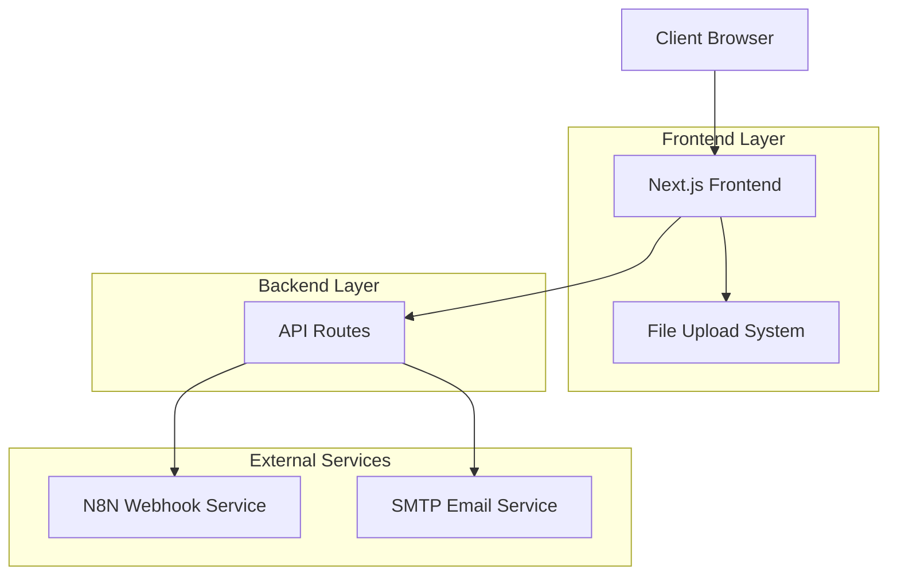

# IA RECRUTEMENT PRO - Architecture Technique

## 1. Architecture Générale



## 2. Stack Technologique

### 2.1 Frontend
- **Framework**: Next.js 15.3.4 (App Router)
- **Runtime**: React 19.0.0
- **Styling**: TailwindCSS 4.0
- **Icons**: Lucide React 0.525.0
- **Charts**: Recharts 3.0.2
- **Utilities**: clsx, tailwind-merge
- **Image Optimization**: Sharp 0.34.3

### 2.2 Backend
- **Runtime**: Node.js (Next.js API Routes)
- **Email Service**: Nodemailer 7.0.5
- **File Processing**: FormData API
- **External Integration**: N8N Webhooks

### 2.3 DevOps & Build
- **TypeScript**: 5.x
- **ESLint**: 9.x avec Next.js config
- **Package Manager**: Yarn
- **Deployment**: Vercel (configuré)

## 3. Structure du Projet

```
src/
├── app/                    # App Router (Next.js 13+)
│   ├── api/               # API Routes
│   │   ├── analyze/       # Analyse des fichiers
│   │   ├── send-email/    # Envoi d'emails
│   │   └── webhook-proxy/ # Proxy webhooks
│   ├── recruiter-results/ # Page résultats recruteur
│   ├── services/ia/       # Page service IA
│   ├── layout.tsx         # Layout principal
│   ├── page.tsx          # Page d'accueil
│   └── globals.css       # Styles globaux
├── components/            # Composants réutilisables
│   ├── layout/           # Composants de mise en page
│   │   ├── header.tsx
│   │   └── footer.tsx
│   ├── sections/         # Sections de page
│   │   ├── hero.tsx
│   │   ├── features.tsx
│   │   └── upload-zone.tsx
│   └── ui/               # Composants UI de base
└── lib/                  # Utilitaires et services
    ├── ai-service.ts     # Service d'analyse IA
    ├── constants.ts      # Constantes de l'app
    └── utils.ts         # Fonctions utilitaires
```

## 4. API Routes

### 4.1 POST /api/analyze
**Fonction**: Analyse des fichiers CV et lettres de motivation

**Configuration**:
- Runtime: nodejs
- Timeout: 30 secondes
- Taille max: 10MB

**Flow**:
1. Validation de la taille des fichiers
2. Extraction des fichiers du FormData
3. Appel au service AI via `analyzeFiles()`
4. Retour des résultats d'analyse

**Paramètres**:
```typescript
interface AnalyzeRequest {
  files: File[] // Fichiers à analyser
}
```

**Réponse**:
```typescript
interface AnalyzeResponse {
  analysisId: string
  // Autres données de l'analyse
}
```

### 4.2 POST /api/send-email
**Fonction**: Envoi d'emails aux candidats

**Configuration SMTP**:
- Host: ssl0.ovh.net
- Port: 465 (SSL)
- Auth: contact@be2web.fr

**Paramètres**:
```typescript
interface EmailRequest {
  to: string
  from: string
  cc?: string
  subject: string
  message: string
  candidateName: string
}
```

**Template Email**: HTML avec design responsive et branding

## 5. Services et Intégrations

### 5.1 Service IA (ai-service.ts)

**Fonction principale**: `analyzeFiles(files: File[])`

**Workflow**:
1. Génération d'un ID unique d'analyse
2. Création du FormData avec fichiers
3. Envoi vers webhook N8N
4. Stockage de l'ID en sessionStorage
5. Retour des résultats

**Webhook N8N**: `https://n8nify.be2web.fr/webhook/690fb674-2054-44c2-8805-5bb30c6091fa`

### 5.2 Gestion des Fichiers

**Types supportés**: PDF, DOC, DOCX, TXT
**Taille maximale**: 10MB par fichier
**Validation**:
- Extension de fichier
- Taille du fichier
- Caractères suspects dans le nom
- Détection de doublons

**Structure des fichiers**:
```typescript
interface FilesByType {
  jobDescription: File[]    // 1 seul fichier max
  motivationLetters: File[] // N fichiers
  cvs: File[]              // N fichiers (= lettres)
}
```

## 6. Composants Principaux

### 6.1 UploadZone
**Localisation**: `src/components/sections/upload-zone.tsx`

**Fonctionnalités**:
- Drag & Drop multi-zones
- Validation en temps réel
- Gestion des erreurs
- Calcul automatique des candidats
- Interface de progression

**États principaux**:
```typescript
const [files, setFiles] = useState<FilesByType>
const [isUploading, setIsUploading] = useState<boolean>
const [validationErrors, setValidationErrors] = useState<string[]>
const [dragOverZone, setDragOverZone] = useState<string | null>
```

### 6.2 Layout Principal
**Localisation**: `src/app/layout.tsx`

**Fonctionnalités**:
- SEO optimisé (métadonnées complètes)
- Open Graph et Twitter Cards
- PWA ready (manifest.json)
- Favicon multi-format
- Font optimization (Inter)

## 7. Configuration et Constantes

### 7.1 Configuration App (constants.ts)
```typescript
export const APP_CONFIG = {
  name: 'IA Recrutement Pro',
  description: 'Plateforme IA pour le recrutement intelligent',
  version: '1.0.0',
}

export const FILE_CONFIG = {
  maxSize: 10 * 1024 * 1024, // 10MB
  allowedTypes: ['.pdf', '.doc', '.docx'],
  maxFiles: 20,
}
```

### 7.2 Configuration TailwindCSS
**Couleurs personnalisées**:
- Primary: #06b6d4 (cyan)
- Dark: #1f2937, #111827
- Gradients: radial et conic

**Responsive**: Mobile-first approach

### 7.3 Configuration Next.js
- **App Router**: Activé
- **TypeScript**: Strict mode
- **Image Optimization**: Sharp
- **Deployment**: Vercel optimisé

## 8. Sécurité

### 8.1 Validation des Fichiers
- Vérification des extensions
- Limite de taille stricte
- Sanitisation des noms de fichiers
- Détection de contenu suspect

### 8.2 API Security
- Validation des Content-Length
- Timeout configurés
- Gestion d'erreurs robuste
- Pas d'exposition de données sensibles

### 8.3 Email Security
- SMTP authentifié
- Adresse de réponse configurée
- Template HTML sécurisé
- Validation des destinataires

## 9. Performance

### 9.1 Optimisations Frontend
- Code splitting automatique (Next.js)
- Image optimization (Sharp)
- Font optimization (next/font)
- CSS-in-JS optimisé (TailwindCSS)

### 9.2 Optimisations Backend
- Timeout API configurés
- Streaming pour gros fichiers
- Gestion mémoire optimisée
- Cache sessionStorage

## 10. Monitoring et Debugging

### 10.1 Logging
- Console.error pour erreurs API
- Tracking des IDs d'analyse
- Logs de validation fichiers

### 10.2 Error Handling
- Try-catch systématique
- Messages d'erreur utilisateur
- Fallbacks gracieux
- Validation côté client et serveur

## 11. Déploiement

### 11.1 Scripts NPM
```json
{
  "dev": "next dev",
  "dev-turbo": "next dev --turbopack",
  "build": "next build",
  "start": "next start",
  "lint": "next lint"
}
```

### 11.2 Configuration Vercel
- Auto-deployment depuis Git
- Variables d'environnement
- Edge functions support
- Analytics intégrées

### 11.3 Variables d'Environnement
```env
# Email Configuration
SMTP_HOST=ssl0.ovh.net
SMTP_PORT=465
SMTP_USER=contact@be2web.fr
SMTP_PASSWORD=votre_mot_de_passe
SMTP_SECURE=true

# Webhook URLs
N8N_WEBHOOK_URL=https://n8nify.be2web.fr/webhook/690fb674-2054-44c2-8805-5bb30c6091fa
```

## 12. Maintenance et Évolutions

### 12.1 Dépendances Critiques
- Next.js: Framework principal
- React: Bibliothèque UI
- TailwindCSS: Styling
- Nodemailer: Service email

### 12.2 Points d'Attention
- Webhook N8N: Point de défaillance unique
- SMTP: Configuration via variables d'environnement
- SessionStorage: Données volatiles
- File upload: Limite de taille

### 12.3 Améliorations Futures
- Base de données pour persistance
- Authentification utilisateur
- Cache Redis pour performance
- Monitoring APM
- Tests automatisés
- CI/CD pipeline

## 13. Documentation Développeur

### 13.1 Installation
```bash
# Clone du projet
git clone [repository-url]
cd ia-recrutement-pro

# Installation des dépendances
yarn install

# Développement local
yarn dev

# Build de production
yarn build
yarn start
```

### 13.2 Structure de Développement
- **Composants**: Approche modulaire
- **Types**: TypeScript strict
- **Styles**: Utility-first (TailwindCSS)
- **State**: React hooks natifs

### 13.3 Conventions de Code
- ESLint configuration Next.js
- Prettier pour formatting
- Naming conventions: camelCase
- Imports: Absolute paths avec @/

---

**Version**: 1.0.0  
**Dernière mise à jour**: Janvier 2025  
**Équipe**: Be2Web Development Team